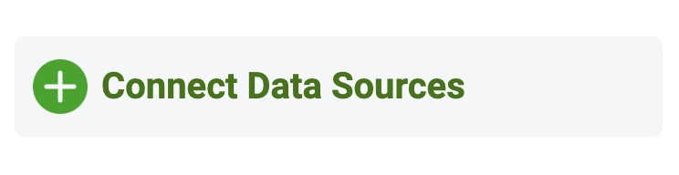
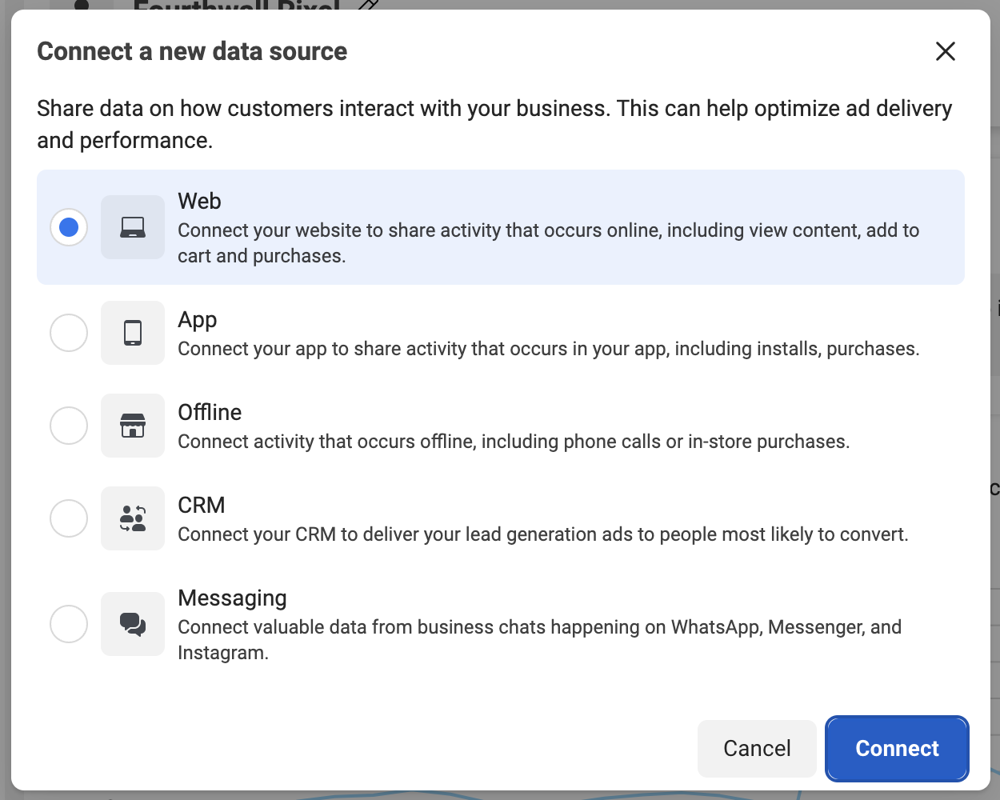
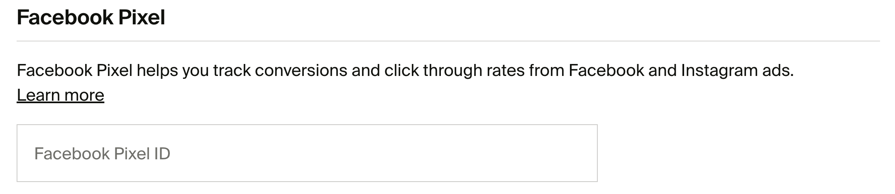
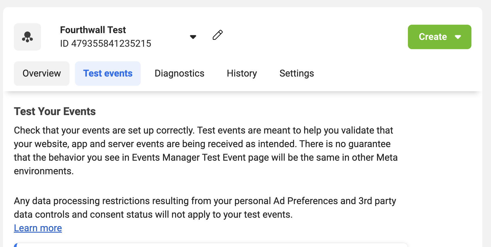

# Setting Up Meta Pixel (Facebook Pixel) on Fourthwall

The [Meta Pixel](https://www.facebook.com/business/tools/meta-pixel) is ideal for tracking visitors to your site and showing them retargeting ads across Facebook and Instagram. It is a piece of code on your website that can help you better understand the effectiveness of your Facebook advertisements and the actions people take on your site, like visiting a page or adding an item to their cart.

## When should you use the Meta Pixel?

Fourthwall automatically supports the [standard Pixel Events](https://www.facebook.com/business/help/402791146561655?id=1205376682832142) (with all relevant metadata) so you can use the Meta Pixel if you want to show retargeting ads or track user behavior like:

- Page views
- View content (Product views)

If you wish, Fourthwall also supports Facebook Conversions API, which provides more accurate tracking even when ad blockers are used. For the most complete data, we recommend using both. You can read more on how to set up Facebook Conversions API here: [Connecting Facebook Conversions API to your Fourthwall Site.](https://help.fourthwall.com/hc/en-us/articles/37430330256539)

This article will guide you through adding a Meta Pixel (Facebook Pixel) to your Fourthwall shop for retargeting.

## Eligibility

In order to sell on Facebook Commerce surfaces as a business, your Facebook account and Page or your Instagram account must meet the following requirements:

- [Commerce Eligibility Requirements](https://help.instagram.com/1627591223954487)

## Prerequisites

Before beginning, you'll need to log in to Facebook's [Commerce Manager](https://business.facebook.com/commerce). If you haven't already, you'll need to create a [Facebook Business account](https://www.facebook.com/business/help/842191386156027?id=533228987210412)

## Create a Facebook Pixel

1. Go to [Meta Events Manager](https://www.facebook.com/events_manager2/)

2. On the left-hand menu, click on "Connect data sources"

3. Select Web and click Connect

4. Enter a name for your pixel and click Create pixel. This will create a new ID that you can view in Events Manager. Your new dataset ID is the same as your new pixel ID.

5. Next, enter your website URL, and click Check, and then Next on the next screen. Your Facebook Pixel has been created but isn't connected to anything yet. Hover over the number and right-click to copy it.

6. Now, navigate back to your Fourthwall dashboard and go to Analytics > Click on the 3 dots icon on the top right > [Tracking pixels](https://my-shop.fourthwall.com/admin/dashboard/analytics/tracking-pixels?redirect). Here, you will find a Facebook Pixel section with a box for you to enter your Facebook pixel ID. Click Save after you have entered your pixel ID and that's it!

7. If you wish, you can test your pixel by returning to Metas Event Manager, and within your pixel management screen, navigate to the Test event tab and scroll down to a section that says "Confirm your website's events are set up correctly" and follow the steps there.

## Next Steps

If you'd like to track specific products, be sure to:

1. Set up [Instagram and Facebook Shopping](https://help.fourthwall.com/how-do-i-set-up-instagram-facebook-shopping)
2. Launch your own [retargeting campaigns](https://www.facebook.com/business/goals/retargeting) to increase conversion rates by advertising your products to supporters on Meta platforms (Facebook, Instagram, etc)

We recommend using the Facebook Conversions API together with Meta Pixel for the most complete data. You can read more on how to set up Facebook Conversions API here: [Connecting Facebook Conversions API to your Fourthwall Site.](https://help.fourthwall.com/hc/en-us/articles/37430330256539)